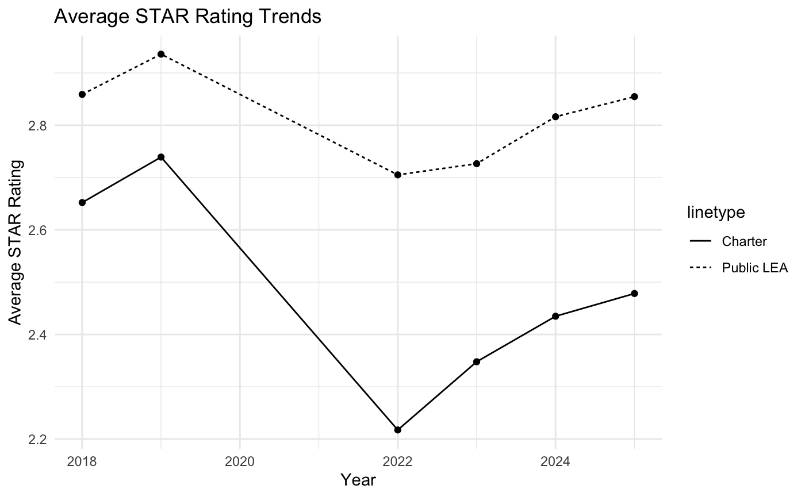
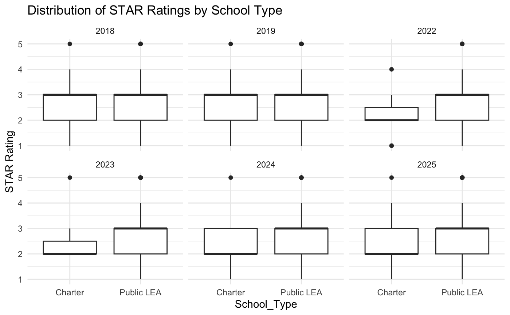
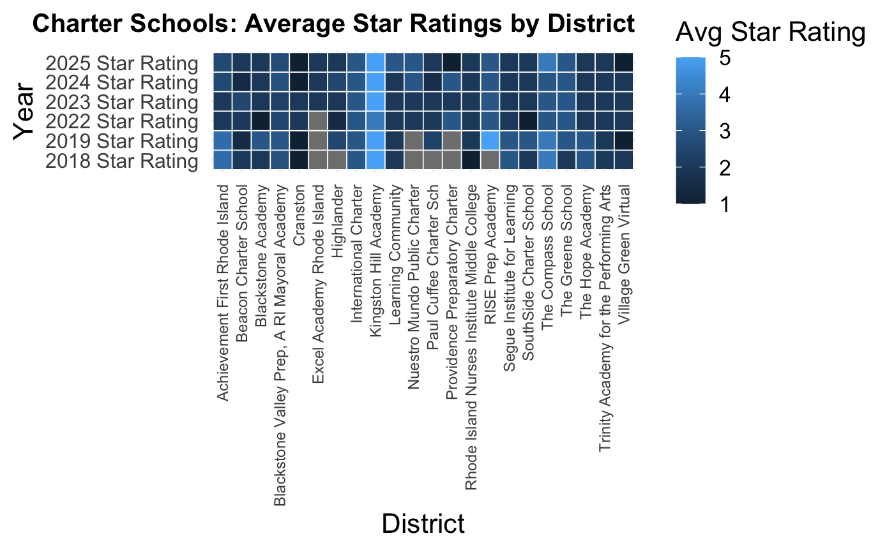
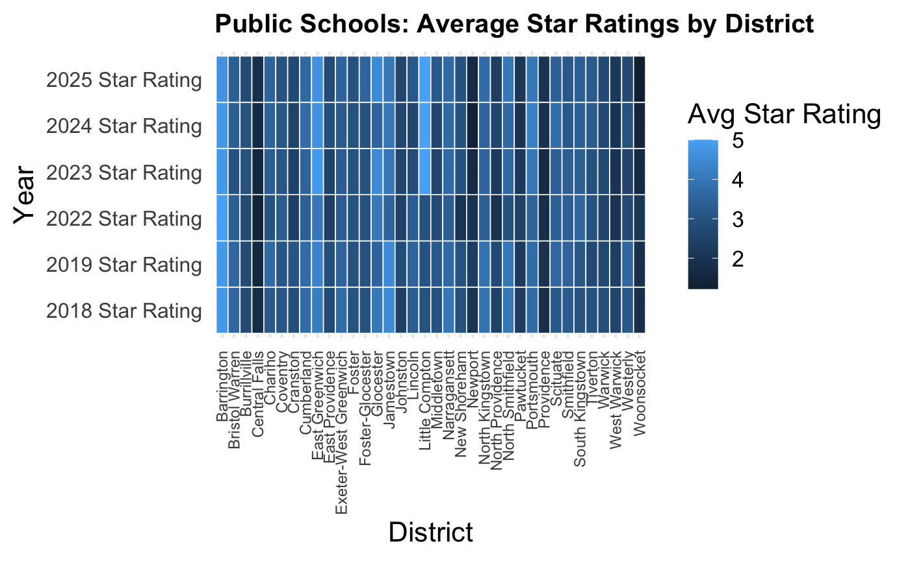

# Rhode Island District vs. Charter School Performance Analysis

## Project Overview

This project analyzes Rhode Island public school performance data to compare traditional district schools and charter schools using statewide STAR ratings.

The analysis was completed during my internship as a Curriculum Consultant to support evidence-based discussions regarding school performance and provide clear, data-driven insights for education stakeholders.

The primary research question was:

> **Do Rhode Island charter schools consistently outperform traditional district schools based on STAR ratings?**

The analysis compares average STAR ratings across multiple years, examines the distribution of ratings between school types, and evaluates differences using statistical hypothesis testing and district-level visualizations.

---

## Project Objectives

The primary objectives of this analysis were to:

- Compare STAR ratings between traditional district schools and charter schools.
- Examine trends in average STAR ratings over time.
- Determine whether observed differences between school types were statistically significant.
- Examine the distribution and variation of STAR ratings within each school type.
- Compare STAR-rating patterns across individual districts.
- Create clear visualizations for communicating findings to education stakeholders.

---

## Dataset

The analysis uses Rhode Island public school performance data containing school- and district-level educational performance indicators.

The primary analysis focuses on STAR ratings for **All Students** across the following years:

- 2018
- 2019
- 2022
- 2023
- 2024
- 2025

The analysis compares selected charter schools with selected traditional public school districts.

---

## Methodology

### Data Preparation

The analysis was performed in R using the original Rhode Island school performance datasets.

Data preparation included:

- Importing the raw CSV datasets.
- Cleaning and standardizing column names.
- Converting STAR-rating variables to numeric values.
- Filtering the analysis to the `All Students` group.
- Removing observations with missing STAR ratings.
- Separating charter and traditional public school groups.
- Aggregating STAR ratings at the district level for additional analysis.

### Statistical Analysis

Average STAR ratings were calculated for charter and traditional public schools for each available year.

Welch two-sample t-tests were then used to evaluate whether the difference in average STAR ratings between the two school types was statistically significant for each year.

### Data Visualization

The analysis includes:

- Average STAR rating trend comparisons
- Boxplots comparing STAR-rating distributions by school type
- District-level histograms
- District-level heatmaps

---

## Key Findings

Traditional public schools had a higher average STAR rating than charter schools in every year included in the analysis.

| Year | Charter Average | Traditional Public Average |
|------|----------------:|----------------------------:|
| 2018 | 2.65 | 2.86 |
| 2019 | 2.74 | 2.94 |
| 2022 | 2.22 | 2.71 |
| 2023 | 2.35 | 2.73 |
| 2024 | 2.43 | 2.82 |
| 2025 | 2.48 | 2.85 |

The largest difference occurred in **2022**, when traditional public schools averaged approximately **0.49 points higher** than charter schools.

Statistical testing found significant differences in:

- **2022:** p = 0.00346
- **2023:** p = 0.02786

The differences were not statistically significant in:

- **2018:** p = 0.3449
- **2019:** p = 0.3805
- **2024:** p = 0.05262
- **2025:** p = 0.08224

These results indicate that the observed differences were particularly strong in 2022 and 2023, but the analysis does **not** establish that school type itself caused the differences in performance.

---

## Visualizations

### Average STAR Rating Trends



This visualization compares average STAR ratings between charter and traditional public schools across the available years.

### STAR Rating Distribution



This boxplot shows the distribution of STAR ratings by school type and year.

### District-Level Analysis





The district-level visualizations provide additional context by showing how STAR ratings vary across individual districts.

Additional district-level histograms are available in the [`visualizations`](visualizations/) directory.

---

## Tools & Technologies

- **R**
- **RStudio**
- **tidyverse**
- **broom**
- **ggplot2**

---

## Repository Structure

```text
ri-district-vs-charter-performance-analysis/
│
├── code/
│   └── internship_project_district_testing.Rmd
│
├── data/
│   └── raw/
│       ├── atsi_groups_data.csv
│       ├── csi_schools_data.csv
│       ├── lea_indicator_data.csv
│       ├── lea_low_performing_subgroups.csv
│       ├── school_indicator_data.csv
│       └── tsi_groups_data.csv
│
├── report/
│   ├── district_performance_analysis_report.txt
│   └── ri-district-vs-charter-performance-analysis.pdf
│
├── visualizations/
│   ├── avg_star_rating_line.png
│   ├── district_tile.png
│   ├── district_tile_2.png
│   ├── freq_by_district_hist.png
│   ├── freq_by_district_hist_2.png
│   ├── freq_by_district_hist_3.png
│   ├── freq_by_district_hist_4.png
│   ├── freq_by_district_hist_5.png
│   └── star_dist_school_type_box.png
│
├── LICENSE
└── README.md
